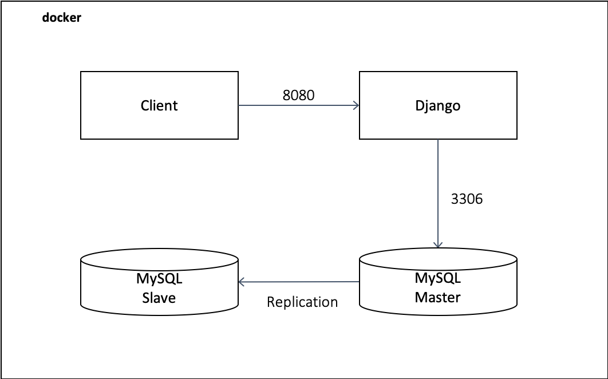

## DRF 기반 회원 가입 및 주문관리 

Django Rest Framework 기반의 사용자 회원 가입 및 주문 정보를 관리하는 backend 이며, Mysql replication 으로 구성됨. 


### 구성

#### Requirements 

본 테스트는 macOS Catalina v.10.15.4 에서 수행 되었습니다. 

* docker 
* docker-compose 

#### 소스 다운로드 및 구조 

소스는 django 소스 구조를 갖고 있으며, docker directory 를 통해 app 배포 합니다. 

```
$ git clone https://github.com/junhwanLee/drf-oms.git
$ cd drf-oms 
$ find ./ -maxdepth 1 
./accounts   # django accounts App 
./manage.py 
./orders     # django orders App 
./drf_oms    # django main directory 
./docker   # docker-compose 관련 directory 
```

#### django 패키지

아래와 같은 패키지로 django 인증 및 backend 구성 됩니다. 

```
$ cat requirements.txt 
django	# django 
djangorestframework 	# drf 
django-rest-knox			# token 기반의 사용자 인증 
django-filter
mysqlclient
```

#### container 환경 



본 환경에서는 총 3개의 container를 이용하여 배포를 진행 합니다. 

```
$ cd docker 
$ cat docker-compose.yml 
version: '3' 
services: 
  mysql_master:
    image: mysql:5.7
		...
  mysql_slave:
    image: mysql:5.7
    ...
  django:
    build: ./django
    ...
```

Mysql 의 경우  각 ./mysql/master, ./mysql/slave 를 loclahost mount 하여 볼륨 구성 

### Intallation

<strong>build.sh</strong> 스크립트를 이용하여 mysql 및 django 이미지를 배포 및 mysql master slave 구성을 진행 합니다. 

```
$ sh build.sh 
...

# 아래 메세지가 출력 되면 master / slave replication 완료 (이미지 빌드 후 약 1 ~ 2분 정도 소요 됨)

*************************** 1. row ***************************
               Slave_IO_State: Waiting for master to send event
                  Master_Host: 172.21.0.2
                  Master_User: mydb_slave_user
                  Master_Port: 3306
                Connect_Retry: 60
              Master_Log_File: mysql-bin.000003
          Read_Master_Log_Pos: 600
               Relay_Log_File: mysql-relay-bin.000002
```


위와 같은 메세지가 보여지면 django db 초기화를 진행. django 컨테이너 내에서 <strong>migrations, migrate</strong> 를 통해 DB 를 초기화 수행 

``` 
$ docker ps 
8b8469992126        docker_django       "/bin/sh -c ./entryp…"   12 minutes ago      Up 12 minutes       0.0.0.0:8080->8080/tcp              docker_django_1
7578dc6695e8        mysql:5.7           "docker-entrypoint.s…"   12 minutes ago      Up 12 minutes       33060/tcp, 0.0.0.0:5506->3306/tcp   mysql_slave
ed3e9678e0fc        mysql:5.7           "docker-entrypoint.s…"   12 minutes ago      Up 12 minutes       33060/tcp, 0.0.0.0:4406->3306/tcp   mysql_master


$ docker exec -it 8b8469992126<django conatiner ID> bash 
root@8b8469992126:/src# python manage.py makemigrations accounts orders 
root@8b8469992126:/src# python manage.py migrate 
```


### 검증

<strong>poc.sh</strong> 스크립트(curl 명령어)를 통해 회원가입, 로그인, 주문목록 조회, 회원 조희 등에 대해 검증 합니다. 해당 스크립트에서는 아래 항목들을 curl 요청을 통해 검증을 진행 합니다. 

* 회원 가입 
* 회원 로그인 
* 주문목록 등록 
* 회원로그아웃 
* 단일 회원 상세 정보 조회 
* 단일 회원 주문 목록 조회 
* 여러 회원 목록 조회 

```
$ sh poc.sh 

{"user":{"id":2,"email":"youngmi@test.com","name":"정영미","nickname":"yougmi","phone":"01083574361","gender":null,"last_order":null},"token":"fa02110425f05c86675ad30c10cc0e81c964a722647d4c21f4a2cf0c00cc36ce"}{"user":{"id":3,"email":"leecg@test.com","name":"이철근","nickname":"leecg","phone":"01083574362","gender":null,"last_order":null},"token":"e74af45f18c8e266e4ebe3d4d07b1097bfc4732f762ed4451836c4bf8025fc5a"}{"user":{"id":4,"email":"dream@test.com","name":"이은겸","nickname":"dream","phone":"01083574363","gender":null,"last_order":null},"token":"b1f83fc111eb78ed393b218ec74317324bf483fdb6f1912af0c229bbbbceac26"}{"user":{"id":5,"email":"sungi@test.com","name":"김선기","nickname":"sungi","phone":"01083574364","gender":null,"last_order":null},"token":"95128224f1b1d156514629466ff23706d244cfa86f3a9f4c9901f15824df1a48"}%
```


#### mysql replication 

```
$ docker exec -it mysql_master mysql -u root -p 
mysql> select * from mydb.accounts_user; 
```

```
$ docker exec -it mysql_slave mysql -u root -p 
mysql> select * from mydb.accounts_user; 
```

 master와 slave 사이에 동기화 확인 


### 참조 

* django-rest-knox : https://github.com/James1345/django-rest-knox 
* mysql master slave : https://github.com/vbabak/docker-mysql-master-slave 